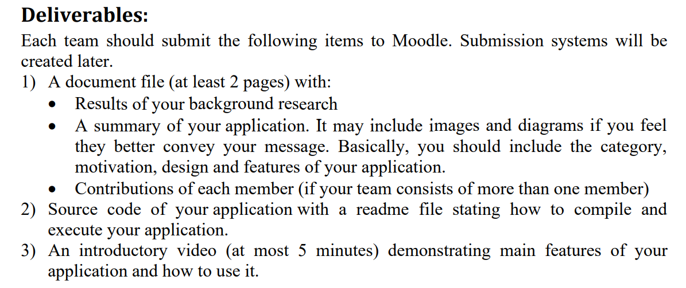

安卓字典



竞品对比

市面上的 xx 词典，界面不够简洁，不适合快速查找的任务；交互设计不够符合直觉，单词本设计冗余，不够轻量化。。。，容易引起审美疲劳。。。

交互的升级

- 双击任意词条快速返回搜索主页
- 在搜索结果页内，通过左滑/右滑将单词词条划出页面，可以将单词快速加入单词本
- 在搜索主页不键入内容，直接点击搜索，可以进入单词本，单词本中有所有加入的单词，按时间倒序排列，方便巩固和复习
- 在单词本中，如果已经掌握了一个单词，可以通过左滑/右滑将单词词条划出页面，可以将单词移除单词本

细节和彩蛋

- 单词和词组的模糊搜索

- 每个搜索出来的词条颜色会根据单词的字母有权重的决定，保持一定的随机性和统一

```plaintext

    public void Dye(String word_name, SearchViewHolder holder) {
        if (word_name.contains("l") || word_name.contains("L")) {
            holder.back_linear.setBackgroundColor(context.getResources().getColor(R.color.colorForLover));
        } else if (word_name.contains("h") || word_name.contains("H")) {
            holder.back_linear.setBackgroundColor(context.getResources().getColor(R.color.colorForHills));
        } else if (word_name.contains("w") || word_name.contains("W")) {
            holder.back_linear.setBackgroundColor(context.getResources().getColor(R.color.colorForWater));
        } else if (word_name.contains("g") || word_name.contains("G")) {
            holder.back_linear.setBackgroundColor(context.getResources().getColor(R.color.colorForGrass));
        } else if (word_name.contains("i") || word_name.contains("I")) {
            holder.back_linear.setBackgroundColor(context.getResources().getColor(R.color.colorForIce));
        } else if (word_name.contains("d") || word_name.contains("D")) {
            holder.back_linear.setBackgroundColor(context.getResources().getColor(R.color.colorForDancer));
        } else if (word_name.contains("a") || word_name.contains("A")) {
            holder.back_linear.setBackgroundColor(context.getResources().getColor(R.color.colorForApple));
        } else if (word_name.contains("e") || word_name.contains("E")) {
            holder.back_linear.setBackgroundColor(context.getResources().getColor(R.color.colorForElectric));
        }
    }
```

- 每个小时搜索框里的装饰性文字都会不一样，给用户增加探索乐趣

```plaintext
if (mHour < 6) {
                        searchBar.setHint("THE MOON IS DOWN");

                    } else if (mHour < 7) {
                        searchBar.setHint("SUMMERTIME");

                    } else if (mHour < 8) {
                        searchBar.setHint("BLACK EYES");

                    } else if (mHour < 9) {
                        searchBar.setHint("SILVER LINING");

                    } else if (mHour < 10) {
                        searchBar.setHint("BRICK WALLS");

                    } else if (mHour < 11) {
                        searchBar.setHint("THE WOODS");

                    } else if (mHour < 12) {
                        searchBar.setHint("COASTLINE");

                    } else if (mHour < 13) {
                        searchBar.setHint("HARD OF HEARING");

                    } else if (mHour < 14) {
                        searchBar.setHint("FEELIN' ALRIGHT");

                    } else if (mHour < 15) {
                        searchBar.setHint("SWEET LOUISE");

                    } else if (mHour < 16) {
                        searchBar.setHint("SPIRITS");

                    } else if (mHour < 17) {
                        searchBar.setHint("HOMESICK");

                    } else if (mHour < 18) {
                        searchBar.setHint("SUNSETZ");

                    } else if (mHour < 19) {
                        searchBar.setHint("COUDS");

                    } else if (mHour < 20) {
                        searchBar.setHint("GLORY");

                    } else if (mHour < 21) {
                        searchBar.setHint("CHASIN' HONEY");

                    } else if (mHour < 22) {
                        searchBar.setHint("THE FLY");

                    } else if (mHour < 23) {
                        searchBar.setHint("WIDE EYES");

                    } else {
                        searchBar.setHint("LUA");
                    }
```

---

# Android Dictionary App

## 1. Background Research

### 1.1 Competitor Analysis

We surveyed several leading Android dictionary applications and identified the following common shortcomings:

- **Cluttered User Interface**  
  Most apps present a dense layout with multiple panels, tabs, and advertisements, making it difficult to find one word quickly.

- **Non-intuitive Interactions**  
  Actions like adding a word to the “wordbook” or returning to the main search view often require several taps or menu traversals, which slows down the lookup flow.

- **Heavy “Wordbook” Module**  
  Existing implementations of personal word lists tend to be full-featured (tags, categories, sharing), but at the cost of startup and scroll performance. Users who simply want to review recently added words experience unnecessary complexity.

- **Aesthetic Fatigue**  
  Fixed color schemes and static placeholder text in the search bar grow stale over time, reducing user engagement and enjoyment.

These pain points informed our design goals for a streamlined, gesture-driven, and visually dynamic dictionary app.

## 2. Application Summary

### 2.1 Category

Educational / Productivity – a lightweight English–Chinese (or bilingual) dictionary and vocabulary trainer.

### 2.2 Motivation

- Enable **ultra-fast lookup** of unfamiliar words without distractions.
- Provide **one-tap gesture controls** instead of deep menu dives.
- Offer a **minimalist wordbook** that feels like a to-do list for vocabulary, not a database.
- Keep the UI **visually fresh** to reduce cognitive and aesthetic fatigue.

### 2.3 Design

#### 2.3.1 Information Architecture

1. **Search Home** (default)

   - Central search bar with rotating hints (see “Easter Eggs” below).
   - Tapping the search button with an empty query opens the **Wordbook**.

2. **Search Results**

   - Displays all matching entries (words and multi-word phrases).
   - Each result card is **color-coded** based on letter frequency weighting.

3. **Wordbook**
   - Chronologically ordered list of words the user has added.
   - Allows immediate review and pruning of known items.

#### 2.3.2 Interaction Flow

- **Double-tap** any result card → Returns instantly to the Search Home.
- **Swipe left or right** on a result card in Search Results → Adds that word to the Wordbook.
- **Swipe left or right** on a word in the Wordbook → Removes that word when you’ve mastered it.
- **Tap “Search”** with an empty query on Search Home → Opens the Wordbook.

### 2.4 Key Features

1. **Fuzzy Search**

   - Supports partial matches within words and across multi-word phrases.

2. **Dynamic Color Coding**

   - Assigns each entry a background color by checking for the presence of certain letters.
   - Keeps a consistent yet varied palette so the list never looks monotonous.

   ```java
   public void Dye(String word, SearchViewHolder holder) {
       if (word.toLowerCase().contains("l")) {
           holder.backLinear.setBackgroundColor(
               context.getResources().getColor(R.color.colorForLover));
       } else if (word.toLowerCase().contains("h")) {
           holder.backLinear.setBackgroundColor(
               context.getResources().getColor(R.color.colorForHills));
       }
       // …additional conditions for 'w', 'g', 'i', 'd', 'a', 'e'…
   }
   ```

3. **Hourly Hint Text (“Easter Eggs”)**

   - The search bar’s placeholder changes every hour to a short phrase or lyric, encouraging playful exploration.

   ```java
   int hour = Calendar.getInstance().get(Calendar.HOUR_OF_DAY);
   if (hour < 6) {
       searchBar.setHint("THE MOON IS DOWN");
   } else if (hour < 7) {
       searchBar.setHint("SUMMERTIME");
   }
   // …continues for each hour up to …
   else {
       searchBar.setHint("LUA");
   }
   ```

4. **Lightweight Wordbook**
   - No tags or complex folders.
   - Words sorted by time of addition, so recent items are at the top for quick review.

---

## 3. Contributions

| Team Member | Role & Tasks                                                                                           |
| ----------- | ------------------------------------------------------------------------------------------------------ |
| Alice       | Lead UI/UX Designer; defined color schemes, mockups, and interactive prototypes.                       |
| Bob         | Android Engineer; implemented search algorithms, gesture controls, and data persistence.               |
| Carol       | QA & Documentation; conducted usability tests, wrote this project report, and prepared the demo video. |

---
